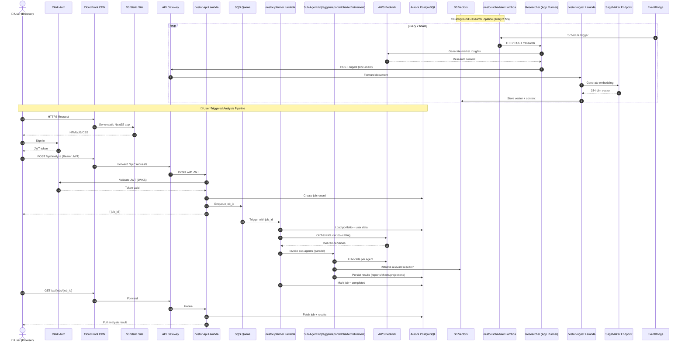

# Sequence Diagram 01 — System Overview

> High-level end-to-end view of **all** NESTOR services. Two independent flows run concurrently:
> - **Research Pipeline** — background, scheduled every 2 hours, builds the knowledge base.
> - **User Analysis Pipeline** — user-triggered, produces a full portfolio analysis.

---

← [Back to Index](../README.md) | Next: [02 — User Analysis Flow](./02_user_analysis_flow.md) →

