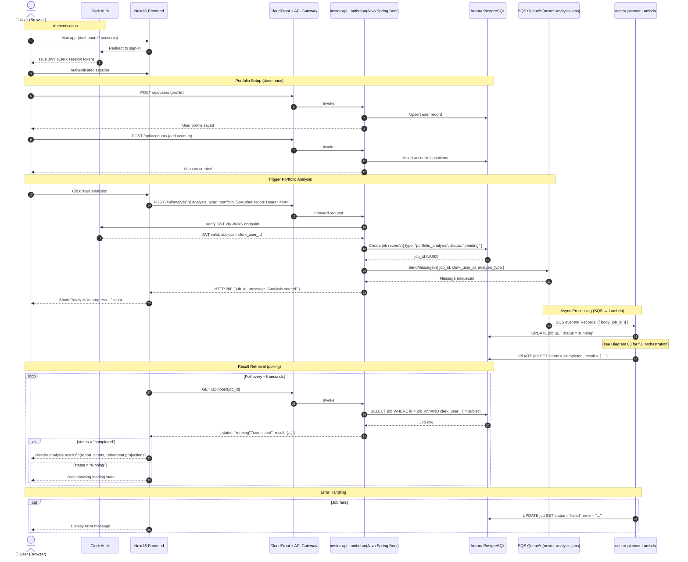

# Sequence Diagram 02 — User-Triggered Analysis Flow

> Detailed flow from the moment a user clicks **"Run Analysis"** in the browser through to retrieving completed results. Covers the frontend, API layer, async job dispatch, and result retrieval.

---

← [01 — System Overview](./01_system_overview.md) | Next: [03 — Planner Orchestration](./03_planner_orchestration.md) →

