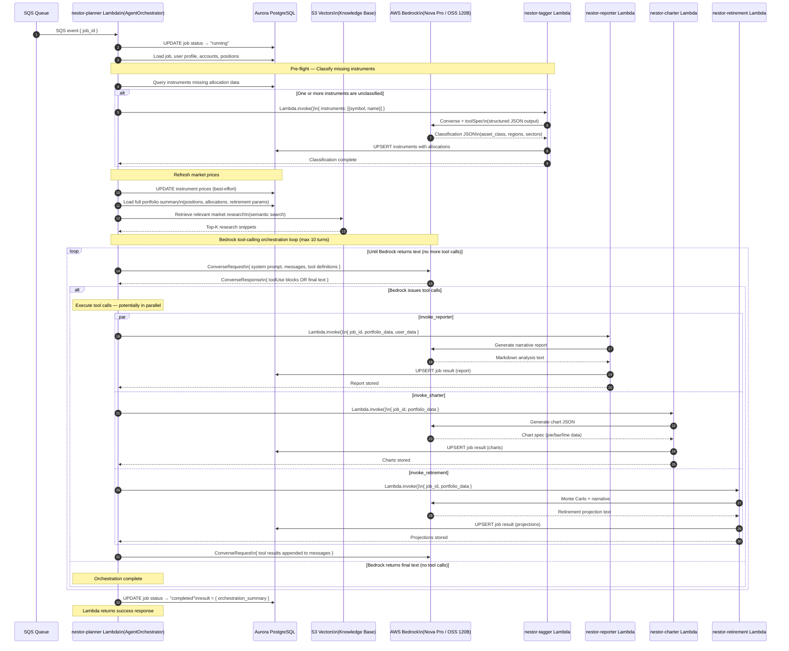

# Sequence Diagram 03 — Planner Orchestration

> Shows how `nestor-planner` acts as the central orchestrator. It uses **AWS Bedrock Converse API tool-calling** in a multi-turn loop to decide which sub-agents to invoke, then fans out to them (potentially in parallel).

### Key Design Points

| Aspect | Detail |
|--------|--------|
| **Orchestration pattern** | Bedrock Converse API multi-turn tool-calling — the LLM decides which agents to call |
| **Parallelism** | Reporter, Charter, Retirement invoked via `CompletableFuture` fan-out |
| **Retry** | Resilience4j `Retry` wraps Bedrock calls; retries on `ThrottlingException` (5 attempts, 4s back-off) |
| **Max turns** | Hard cap of 10 conversation turns to prevent infinite loops |
| **Data flow** | All sub-agents read portfolio from Aurora; all write results back to Aurora |
| **Tagger is special** | Always runs **before** orchestration as a pre-flight step if any instrument lacks classification |

---

← [02 — User Analysis Flow](./02_user_analysis_flow.md) | Next: [04 — Research Ingestion Pipeline](./04_research_ingestion.md) →

