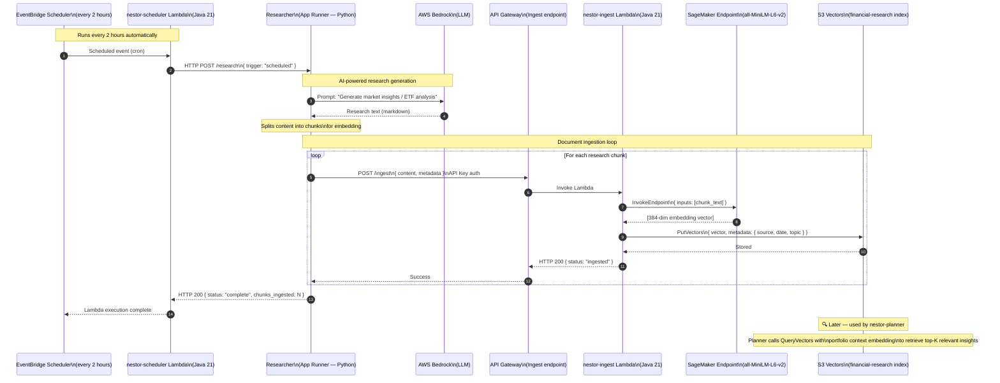

# Sequence Diagram 04 — Research Ingestion Pipeline

> Shows the background knowledge-base build flow. **EventBridge** fires every 2 hours, triggering the scheduler Lambda which calls the **Researcher** (App Runner). The Researcher generates market insights which are ingested, embedded, and stored in **S3 Vectors** for later retrieval by the Planner.

### Infrastructure Notes

| Component | Detail |
|-----------|--------|
| **EventBridge rule** | `rate(2 hours)` — configurable, can be disabled via `scheduler_enabled = false` in Terraform |
| **Scheduler Lambda** | Lightweight Java function; no AI, just HTTP POST trigger |
| **Researcher** | Python App Runner service shared with Alex; uses OpenAI Agents SDK + LiteLLM → Bedrock |
| **Ingest Lambda** | Java 21 Spring Cloud Function; generates embedding then upserts to S3 Vectors |
| **SageMaker** | `all-MiniLM-L6-v2` — 384-dimension sentence embeddings |
| **S3 Vectors** | `alex-vectors-{account-id}`, index `financial-research`, cosine similarity |
| **API Key** | Ingest API Gateway is key-protected to prevent unauthorized ingestion |

---

← [03 — Planner Orchestration](./03_planner_orchestration.md) | Next: [05 — Instrument Classification (Tagger)](./05_tagger_flow.md) →

