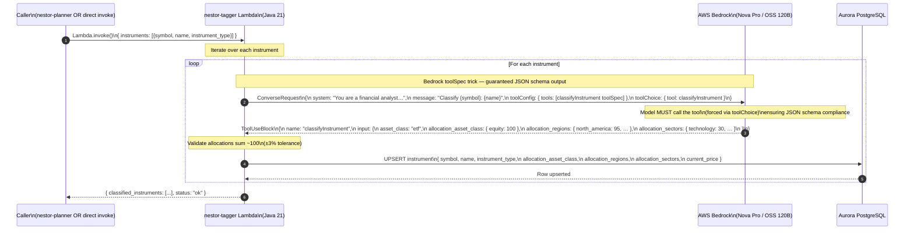

# Sequence Diagram 05 — Instrument Classification (Tagger)

> Shows how the **Tagger** agent classifies financial instruments (ETFs, stocks, bonds) using **Bedrock's `toolSpec` trick** — forcing a tool call to guarantee structured JSON output — and persists the result to Aurora.



### Bedrock Structured Output Pattern

The Tagger uses the **"toolSpec trick"**: instead of asking the LLM to return JSON in plain text (which can fail), it defines a JSON-schema tool and forces the model to call it via `toolChoice`. This guarantees the response conforms to the schema.

```
Tool definition (simplified):
{
  name: "classifyInstrument",
  inputSchema: {
    properties: {
      allocation_asset_class: { equity: %, fixed_income: %, … },
      allocation_regions:     { north_america: %, europe: %, … },
      allocation_sectors:     { technology: %, healthcare: %, … }
    }
  }
}
```

### Data Written to Aurora

| Column | Example |
|--------|---------|
| `symbol` | `VTI` |
| `name` | `Vanguard Total Stock Market ETF` |
| `instrument_type` | `etf` |
| `allocation_asset_class` | `{"equity": 100}` |
| `allocation_regions` | `{"north_america": 95, "international": 5}` |
| `allocation_sectors` | `{"technology": 30, "healthcare": 15, …}` |
| `current_price` | `250.00` |

---

← [04 — Research Ingestion Pipeline](./04_research_ingestion.md) | Next: [06 — Authentication & API Gateway](./06_auth_and_api.md) →

