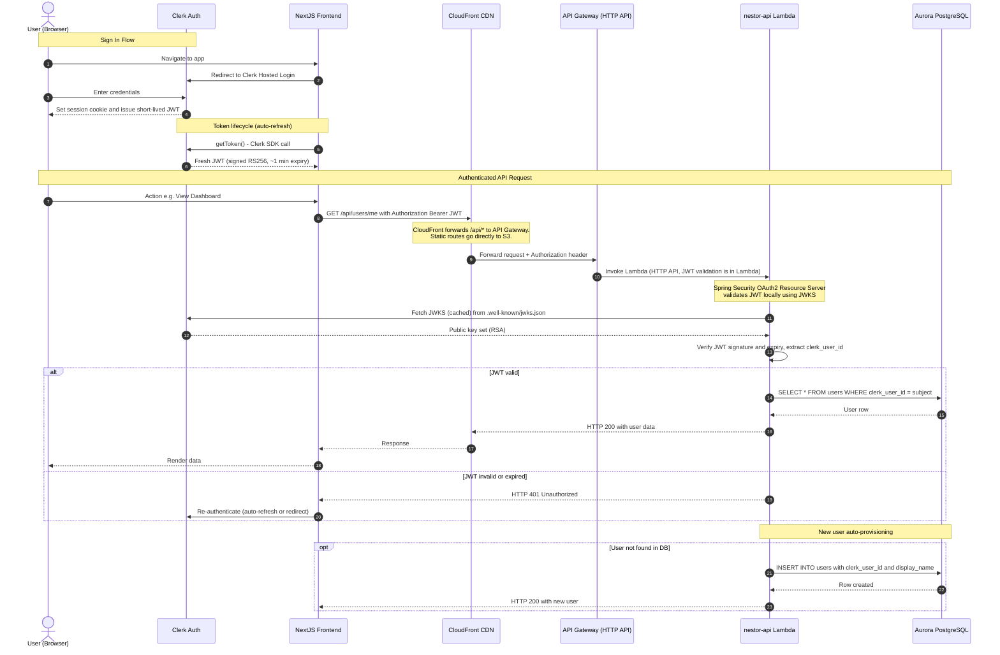

# Sequence Diagram 06 - Authentication and API Gateway
> Shows how **Clerk JWT authentication** flows from the browser through CloudFront, API Gateway, to the `nestor-api` Lambda for every protected request.

### Routing Rules
| Path | CloudFront Behaviour | Destination |
|------|---------------------|-------------|
| `/api/*` | Forward to API Gateway origin | `nestor-api` Lambda |
| `/_next/*`, `/*.js`, `/*.css` | Cache at edge | S3 Static Site |
| `/*` (catch-all) | Serve `index.html` | S3 Static Site |
### Security Configuration
| Layer | Mechanism |
|-------|-----------|
| **Transport** | TLS 1.2+ enforced by CloudFront |
| **Authentication** | Clerk JWT (RS256) - validated in `nestor-api` via Spring Security |
| **JWKS caching** | Public keys cached in Lambda memory; refreshed on cache miss |
| **CORS** | Configured on API Gateway for the CloudFront domain |
| **Ingest API** | Separate API Gateway, protected by API Key (not JWT) |
---
[05 - Instrument Classification (Tagger)](./05_tagger_flow.md) | Next: [07 - Deployment Pipeline](./07_deployment_pipeline.md)