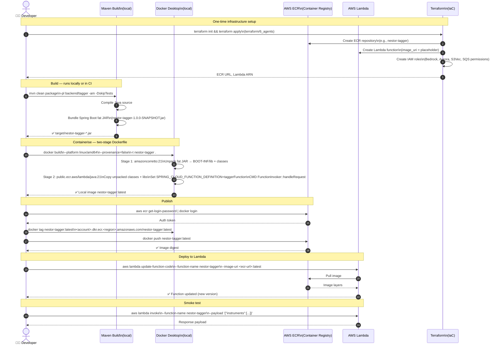

# Sequence Diagram 07 — Deployment Pipeline

> Shows how a NESTOR agent goes from Java source code to a live AWS Lambda function. The same pattern applies to **all Java Lambda modules** (tagger, planner, reporter, charter, retirement, ingest, scheduler, api).



### Dockerfile Pattern (Shared by All Agents)

```dockerfile
# Stage 1: Unpack fat JAR (amazoncorretto:21)
RUN mkdir -p unpacked && cd unpacked && jar xf ../app.jar

# Stage 2: Lambda runtime (public.ecr.aws/lambda/java:21)
COPY BOOT-INF/lib/     ${LAMBDA_TASK_ROOT}/lib/
COPY BOOT-INF/classes/ ${LAMBDA_TASK_ROOT}/
COPY META-INF/         ${LAMBDA_TASK_ROOT}/META-INF/
ENV  SPRING_CLOUD_FUNCTION_DEFINITION=<beanName>
CMD  ["org.springframework.cloud.function.adapter.aws.FunctionInvoker::handleRequest"]
```

> ⚠️ **Always use `--provenance=false`** — Docker BuildKit OCI attestation manifests are rejected by Lambda.

### Per-Module Cheat Sheet

| Module | Maven module | Spring bean | ECR repo |
|--------|-------------|------------|---------|
| API | `backend/api` | `streamLambdaHandler` | `nestor-api` |
| Planner | `backend/planner` | `plannerFunction` | `nestor-planner` |
| Tagger | `backend/tagger` | `taggerFunction` | `nestor-tagger` |
| Reporter | `backend/reporter` | `reporterFunction` | `nestor-reporter` |
| Charter | `backend/charter` | `charterFunction` | `nestor-charter` |
| Retirement | `backend/retirement` | `retirementFunction` | `nestor-retirement` |
| Ingest | `backend/ingest` | `ingestFunction` | `nestor-ingest` |
| Scheduler | `backend/scheduler` | `schedulerFunction` | `nestor-scheduler` |

---

← [06 — Authentication & API Gateway](./06_auth_and_api.md) | [Back to Index](../README.md) →

