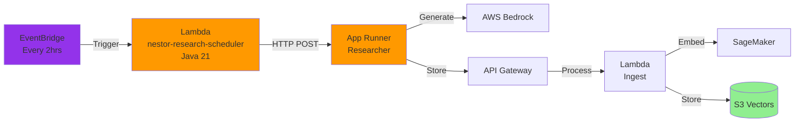

# Building NESTOR: Part 4 - Researcher Agent & Scheduler

In this guide, you'll deploy the Researcher service (App Runner, shared with Alex) and the **NESTOR Scheduler Lambda** — the first Java container-image Lambda in your stack.

## What is Deployed

1. **Researcher Agent** (App Runner) — shared with Alex, unchanged
2. **Scheduler Lambda** —  Java/Spring Cloud Function, deployed as a Docker container image via ECR

The Researcher runs on App Runner and uses Bedrock for AI capabilities. The Scheduler is a lightweight Lambda that triggers the Researcher on a schedule.

## Architecture



## Prerequisites

- Completed Guides 1-3
- Docker Desktop **running**
- Java 21, Maven 3.9+
- AWS CLI configured
- Access to AWS Bedrock models

## Step 0: Request Bedrock Model Access

1. Navigate to **Amazon Bedrock** in AWS Console
2. Switch to **us-west-2** (or your chosen region)
3. **Model access** → **Manage model access**
4. Request access to **OpenAI GPT OSS 120B** or **Amazon Nova Pro**

## Step 1: Deploy the Researcher (App Runner)

The Researcher is shared infrastructure. If you already deployed it for Alex, skip to Step 2.

```bash
# Use the Alex terraform for App Runner
cd terraform/4_researcher
cp terraform.tfvars.example terraform.tfvars
```

Edit `terraform.tfvars` and deploy:
```bash
terraform init
terraform apply
```

Note the App Runner URL from the output — you'll need it for the NESTOR scheduler.

## Step 2: Build the NESTOR Scheduler

```bash
# Build from NESTOR root
cd NESTOR
mvn clean package -pl backend/scheduler -am -DskipTests
```

This produces `NESTOR/backend/scheduler/target/nestor-scheduler-1.0.0-SNAPSHOT.jar`.

## Step 3: Build and Push Docker Image

```bash
cd NESTOR/backend/scheduler

# Build the container image
docker build --platform linux/amd64 --provenance=false -t nestor-scheduler .
```

> **IMPORTANT**: Always use `--provenance=false`. Without it, Docker BuildKit adds OCI attestation manifests that Lambda rejects with "image manifest media type not supported".

## Step 4: Deploy NESTOR Scheduler Terraform

```bash
cd NESTOR/terraform/4_researcher
cp terraform.tfvars.example terraform.tfvars
```

Edit `terraform.tfvars`:
```hcl
aws_region = "us-east-1"
app_runner_url = "https://your-app-runner-url.us-east-1.awsapprunner.com"
scheduler_enabled = false  # Set true to enable EventBridge schedule
```

Deploy:
```bash
terraform init
terraform apply
```

This creates:
- ECR repository: `nestor-scheduler`
- Lambda function: `nestor-research-scheduler` (container image)
- IAM role with CloudWatch and ECR permissions
- EventBridge schedule (optional, when `scheduler_enabled = true`)

## Step 5: Push Image to ECR

```bash
# Authenticate Docker with ECR
aws ecr get-login-password --region us-east-1 | docker login --username AWS --password-stdin {account-id}.dkr.ecr.us-east-1.amazonaws.com

# Tag and push
docker tag nestor-scheduler:latest {account-id}.dkr.ecr.us-east-1.amazonaws.com/nestor-scheduler:latest
docker push {account-id}.dkr.ecr.us-east-1.amazonaws.com/nestor-scheduler:latest

# Update the Lambda to use the image
aws lambda update-function-code --function-name nestor-research-scheduler \
  --image-uri {account-id}.dkr.ecr.us-east-1.amazonaws.com/nestor-scheduler:latest
```

Replace `{account-id}` with your AWS account ID.

## Step 6: Test

```bash
# Create test payload
echo '{}' > test_payload.json

# Invoke the scheduler Lambda
aws lambda invoke \
  --function-name nestor-research-scheduler \
  --cli-binary-format raw-in-base64-out \
  --payload file://test_payload.json \
  --region us-east-1 \
  response.json

cat response.json
```

Expected: A 200 response with research trigger result (or error if App Runner is not running).

## Dockerfile Explained

The scheduler Dockerfile uses the **verified two-stage `jar xf` approach**:

```dockerfile
# Stage 1: Unpack the pre-built fat JAR
FROM amazoncorretto:21 AS builder
COPY target/nestor-scheduler-*.jar app.jar
RUN mkdir -p unpacked && cd unpacked && jar xf ../app.jar

# Stage 2: Lambda runtime
FROM public.ecr.aws/lambda/java:21
COPY --from=builder /opt/app/unpacked/BOOT-INF/lib/ ${LAMBDA_TASK_ROOT}/lib/
COPY --from=builder /opt/app/unpacked/BOOT-INF/classes/ ${LAMBDA_TASK_ROOT}/
COPY --from=builder /opt/app/unpacked/META-INF/ ${LAMBDA_TASK_ROOT}/META-INF/
ENV SPRING_CLOUD_FUNCTION_DEFINITION=schedulerFunction
CMD ["org.springframework.cloud.function.adapter.aws.FunctionInvoker::handleRequest"]
```

> **Why not Spring Boot layer extraction?** The `java -Djarmode=tools ... extract --layers` approach places all files under `BOOT-INF/` subdirectories which are NOT on Lambda's classpath, causing `ClassNotFoundException`. The `jar xf` approach properly unpacks the contents.

## Next Steps

Continue to [5_database.md](5_database.md) for database setup.
