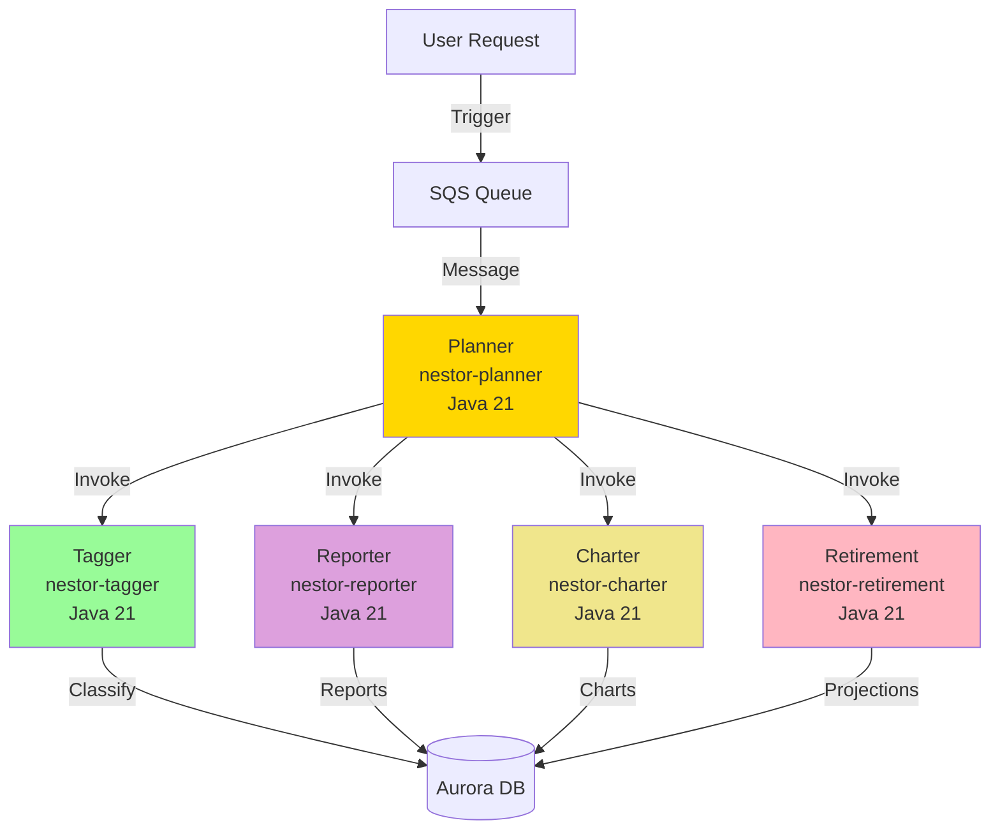

# Building NESTOR: Part 6 - AI Agent Orchestra

This is the core of NESTOR — deploying Java-based AI agents as containerized Lambda functions. Each agent is a Spring Cloud Function bean deployed as a Docker image via ECR.

## What is built

Five specialized AI agents, each as a Java Lambda:

1. **Tagger**  — Classifies financial instruments using Bedrock structured outputs
2. **Planner**  — Orchestrator that coordinates all agents
3. **Reporter**  — Generates portfolio analysis reports
4. **Charter**  — Creates data visualizations using Bedrock plain text with JSON extraction
5. **Retirement**  — Projects retirement scenarios

## Architecture



## Prerequisites

- Completed Guides 1-5 (all infrastructure deployed)
- Docker Desktop **running**
- Java 21, Maven 3.9+
- AWS CLI configured
- Access to AWS Bedrock models

## Key Difference from Alex

| Aspect | Alex (Python) | NESTOR (Java) |
|--------|--------------|---------------|
| Package format | ZIP uploaded to S3 | Docker image pushed to ECR |
| Runtime | `python3.12` | Container image (Java 21) |
| Handler | `lambda_handler.lambda_handler` | `FunctionInvoker::handleRequest` |
| Framework | OpenAI Agents SDK + LiteLLM | Spring Cloud Function + AWS SDK v2 |
| Agent pattern | `Agent` + `Runner.run()` | Spring bean `Function<Map, Map>` + Bedrock Converse API |
| Structured outputs | Pydantic models | Jackson POJOs + Bedrock `toolSpec` trick |
| Build tool | uv + package_docker.py | Maven + Dockerfile |

## Step 1: Request Bedrock Model Access

Ensure access to your chosen model in AWS Bedrock console:
- **Amazon Nova Pro** (`us.amazon.nova-pro-v1:0`) — recommended
- **OpenAI OSS 120B** (`openai.gpt-oss-120b-1:0`) — available in us-west-2/us-east-1

## Step 2: Build the Tagger

```bash
cd NESTOR
mvn clean package -pl backend/tagger -am -DskipTests
```

## Step 3: Build Docker Image

```bash
cd NESTOR/backend/tagger
docker build --platform linux/amd64 --provenance=false -t nestor-tagger .
```

> **CRITICAL**: Always use `--provenance=false`. Docker BuildKit's attestation manifests are rejected by Lambda.

### Dockerfile Pattern (All Agents Use This)

```dockerfile
# Stage 1: Unpack fat JAR
FROM amazoncorretto:21 AS builder
WORKDIR /opt/app
COPY target/nestor-<module>-*.jar app.jar
RUN mkdir -p unpacked && cd unpacked && jar xf ../app.jar

# Stage 2: Lambda runtime
FROM public.ecr.aws/lambda/java:21
COPY --from=builder /opt/app/unpacked/BOOT-INF/lib/ ${LAMBDA_TASK_ROOT}/lib/
COPY --from=builder /opt/app/unpacked/BOOT-INF/classes/ ${LAMBDA_TASK_ROOT}/
COPY --from=builder /opt/app/unpacked/META-INF/ ${LAMBDA_TASK_ROOT}/META-INF/

ENV SPRING_CLOUD_FUNCTION_DEFINITION=<beanName>
CMD ["org.springframework.cloud.function.adapter.aws.FunctionInvoker::handleRequest"]
```

> **WARNING**: Do NOT use `java -Djarmode=tools ... extract --layers`. It places files under `BOOT-INF/` subdirectories that Lambda cannot find on the classpath. Use `jar xf` instead.

## Step 4: Deploy NESTOR Terraform

```bash
cd NESTOR/terraform/6_agents
cp terraform.tfvars.example terraform.tfvars
```

Edit `terraform.tfvars`:
```hcl
aws_region = "us-east-1"
aurora_cluster_arn = "arn:aws:rds:us-east-1:123456789012:cluster:alex-aurora-cluster"
aurora_secret_arn  = "arn:aws:secretsmanager:us-east-1:123456789012:secret:alex-aurora-credentials-xxxxx"
bedrock_model_id   = "us.amazon.nova-pro-v1:0"
bedrock_region     = "us-east-1"
```

Get Aurora ARNs from the database terraform:
```bash
cd terraform/5_database
terraform output
```

Deploy:
```bash
cd NESTOR/terraform/6_agents
terraform init
terraform apply
```

This creates (for the tagger):
- ECR repository: `nestor-tagger`
- Lambda function: `nestor-tagger` (`package_type = "Image"`)
- IAM role with Bedrock, Aurora, ECR permissions
- CloudWatch log group

## Step 5: Push Image to ECR and Update Lambda

```bash
# Authenticate Docker with ECR
aws ecr get-login-password --region us-east-1 | \
  docker login --username AWS --password-stdin {account-id}.dkr.ecr.us-east-1.amazonaws.com

# Tag and push
docker tag nestor-tagger:latest {account-id}.dkr.ecr.us-east-1.amazonaws.com/nestor-tagger:latest
docker push {account-id}.dkr.ecr.us-east-1.amazonaws.com/nestor-tagger:latest

# Update Lambda (after push, or if image already pushed before terraform apply)
aws lambda update-function-code --function-name nestor-tagger \
  --image-uri {account-id}.dkr.ecr.us-east-1.amazonaws.com/nestor-tagger:latest
```

## Step 6: Test the Tagger

```bash
# Create test payload
cat > test_payload.json << 'EOF'
{
  "instruments": [
    {
      "symbol": "VTI",
      "name": "Vanguard Total Stock Market ETF",
      "instrument_type": "etf"
    }
  ]
}
EOF

# Invoke
aws lambda invoke \
  --function-name nestor-tagger \
  --cli-binary-format raw-in-base64-out \
  --payload file://test_payload.json \
  --region us-east-1 \
  response.json

cat response.json
```

Expected response:
```json
{
  "statusCode": 200,
  "body": {
    "tagged": 1,
    "updated": ["VTI"],
    "errors": [],
    "classifications": [...]
  }
}
```

## Step 7: Build the Charter

The Charter agent generates Recharts-compatible chart JSON from portfolio data. Unlike the Tagger (which uses Bedrock structured output via tool-use), the Charter uses **plain text** Bedrock calls and extracts JSON from the response.

### Key Differences from Tagger

| Aspect | Tagger | Charter |
|--------|--------|---------|
| Bedrock mode | Structured output (tool-use trick) | Plain text with JSON extraction |
| Output type | `InstrumentClassification` POJO | `Map<String, Object>` chart data |
| DB table | `instruments` | `jobs` (charts_payload column) |
| Retry on | `ThrottlingException` | `ThrottlingException` |
| Spring bean | `taggerFunction` | `charterFunction` |

### Charter Source Code Structure

```
NESTOR/backend/charter/src/main/java/com/nestor/charter/
├── CharterConfig.java       # Spring Boot app + bean wiring
├── CharterFunction.java     # Lambda entry point (Function<Map,Map>)
├── CharterTemplates.java    # Prompt templates for chart generation
├── ChartGenerator.java      # Bedrock call + JSON extraction + retry
└── PortfolioAnalyzer.java   # Pure-computation portfolio analysis
```

### Build the JAR

```bash
cd NESTOR
mvn clean package -pl backend/charter -am -DskipTests
```

## Step 8: Build and Push Charter Docker Image

```bash
cd NESTOR/backend/charter
docker build --platform linux/amd64 --provenance=false -t nestor-charter .
```

> **CRITICAL**: Always use `--provenance=false`. Docker BuildKit's attestation manifests are rejected by Lambda.

Authenticate, tag, and push:
```bash
# Authenticate Docker with ECR
aws ecr get-login-password --region us-east-1 | \
  docker login --username AWS --password-stdin {account-id}.dkr.ecr.us-east-1.amazonaws.com

# Tag and push
docker tag nestor-charter:latest {account-id}.dkr.ecr.us-east-1.amazonaws.com/nestor-charter:latest
docker push {account-id}.dkr.ecr.us-east-1.amazonaws.com/nestor-charter:latest
```

## Step 9: Deploy Charter Infrastructure

The charter ECR repository and Lambda function are already defined in `NESTOR/terraform/6_agents/main.tf`. If you haven't applied them yet:

```bash
cd NESTOR/terraform/6_agents

# First create the ECR repo (Lambda needs an image to exist)
terraform apply -target="aws_ecr_repository.charter" -target="aws_ecr_lifecycle_policy.charter" -target="aws_cloudwatch_log_group.charter_logs" -auto-approve

# Push the image (Step 8 above)

# Then create the Lambda
terraform apply
```

If the image was already pushed, you can update Lambda directly:
```bash
aws lambda update-function-code --function-name nestor-charter \
  --image-uri {account-id}.dkr.ecr.us-east-1.amazonaws.com/nestor-charter:latest
```

## Step 10: Test the Charter

Create a test payload with portfolio data:
```bash
cat > charter_test_payload.json << 'EOF'
{
  "job_id": "00000000-0000-0000-0000-000000000001",
  "portfolio_data": {
    "accounts": [
      {
        "name": "Retirement 401k",
        "type": "401k",
        "cash_balance": 5000.00,
        "positions": [
          {
            "symbol": "VTI",
            "quantity": 150,
            "instrument": {
              "name": "Vanguard Total Stock Market ETF",
              "current_price": 250.00,
              "instrument_type": "etf",
              "allocation_asset_class": {"equity": 100},
              "allocation_regions": {"north_america": 100},
              "allocation_sectors": {"technology": 30, "healthcare": 15, "financials": 15, "consumer_discretionary": 12, "industrials": 10, "energy": 5, "utilities": 3, "real_estate": 3, "materials": 3, "communication": 4}
            }
          },
          {
            "symbol": "BND",
            "quantity": 200,
            "instrument": {
              "name": "Vanguard Total Bond Market ETF",
              "current_price": 75.00,
              "instrument_type": "etf",
              "allocation_asset_class": {"fixed_income": 100},
              "allocation_regions": {"north_america": 100},
              "allocation_sectors": {"treasury": 45, "corporate": 30, "mortgage": 15, "government_related": 10}
            }
          }
        ]
      },
      {
        "name": "Taxable Brokerage",
        "type": "taxable",
        "cash_balance": 2500.00,
        "positions": [
          {
            "symbol": "VXUS",
            "quantity": 100,
            "instrument": {
              "name": "Vanguard Total International Stock ETF",
              "current_price": 60.00,
              "instrument_type": "etf",
              "allocation_asset_class": {"equity": 100},
              "allocation_regions": {"europe": 40, "asia": 35, "north_america": 5, "latin_america": 10, "africa": 5, "middle_east": 5},
              "allocation_sectors": {"technology": 15, "financials": 20, "industrials": 12, "consumer_discretionary": 10, "healthcare": 10, "energy": 8, "materials": 8, "communication": 7, "utilities": 5, "consumer_staples": 5}
            }
          }
        ]
      }
    ]
  }
}
EOF
```

Invoke:
```bash
aws lambda invoke \
  --function-name nestor-charter \
  --cli-binary-format raw-in-base64-out \
  --payload file://charter_test_payload.json \
  --region us-east-1 \
  charter_response.json

cat charter_response.json
```

Expected response:
```json
{
  "statusCode": 200,
  "body": {
    "success": false,
    "message": "Failed to generate charts",
    "charts_generated": 5,
    "chart_keys": [
      "asset_class_distribution",
      "account_type_allocation",
      "geographic_exposure",
      "sector_breakdown",
      "top_holdings_concentration"
    ]
  }
}
```

> **Note**: `success: false` is expected with a test `job_id` — the charter generated 5 charts successfully but the DB update found 0 matching rows (the test UUID doesn't exist in the `jobs` table). When invoked by the Planner with a real job ID, `success` will be `true`.

## Adding More Agents

As you build each additional agent (planner, reporter, retirement), the workflow is the same:

1. **Code**: Implement the Java module in `NESTOR/backend/<agent>/`
2. **Build JAR**: `mvn clean package -pl backend/<agent> -am -DskipTests`
3. **Build Docker**: `docker build --platform linux/amd64 --provenance=false -t nestor-<agent> .`
4. **Update Terraform**: Add ECR repo + Lambda resource in `NESTOR/terraform/6_agents/main.tf`
5. **Deploy**: `terraform apply` (create ECR first if needed, then push image, then full apply)
6. **Push Image**: Tag, push to ECR, update Lambda function code
7. **Test**: Invoke with test payload

## Monitoring

View CloudWatch logs:
```bash
# Tagger logs
aws logs tail /aws/lambda/nestor-tagger --follow

# Charter logs
aws logs tail /aws/lambda/nestor-charter --follow
```

To build and push a container image (example: reporter):

1. Build the JAR:
   cd NESTOR
   mvn clean package -pl backend/reporter -am -DskipTests

2. Authenticate Docker with ECR:
   aws ecr get-login-password --region us-east-1 | docker login --username AWS --password-stdin <YOUR_ACCOUNT_ID>.dkr.ecr.us-east-1.amazonaws.com

3. Build and push the Docker image:
   cd NESTOR/backend/reporter
   docker build --platform linux/amd64 --provenance=false -t nestor-reporter .
   docker tag nestor-reporter:latest <YOUR_ACCOUNT_ID>.dkr.ecr.us-east-1.amazonaws.com/nestor-reporter:latest
   docker push <YOUR_ACCOUNT_ID>.dkr.ecr.us-east-1.amazonaws.com/nestor-reporter:latest

4. Update the Lambda to use the new image:
   aws lambda update-function-code --function-name nestor-reporter --image-uri <YOUR_ACCOUNT_ID>.dkr.ecr.us-east-1.amazonaws.com/nestor-reporter:latest

5. Monitor in CloudWatch Logs:
   - /aws/lambda/nestor-tagger
   - /aws/lambda/nestor-charter
   - /aws/lambda/nestor-retirement
   - /aws/lambda/nestor-reporter

Bedrock Model: openai.gpt-oss-120b-1:0
Region: us-east-1

EOT
sqs_queue_arn = "arn:aws:sqs:us-east-1:<YOUR_ACCOUNT_ID>:nestor-analysis-jobs"
sqs_queue_url = "https://sqs.us-east-1.amazonaws.com/<YOUR_ACCOUNT_ID>/nestor-analysis-jobs"


## Next Steps

Continue to [7_frontend.md](7_frontend.md) for the frontend & API deployment.
