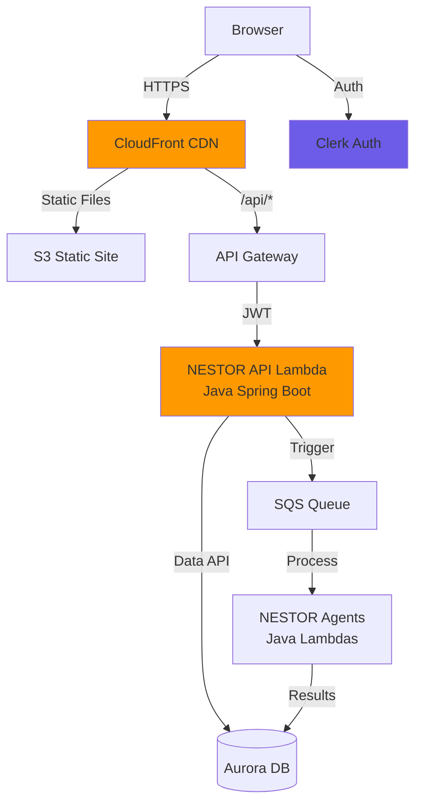

# Building NESTOR: Part 7 - Frontend & API

NESTOR includes its own NextJS React frontend and Java Spring Boot API Lambda. The frontend is a static site hosted on S3 behind CloudFront CDN, communicating with the NESTOR Java API via API Gateway.

## What You're Building

- **Frontend**: NextJS React application (static export to S3)
- **API Lambda**: Java Spring Boot with `aws-serverless-java-container` (container image on ECR)
- **Infrastructure**: S3 static site, CloudFront CDN, API Gateway HTTP API

## Architecture



## Prerequisites

- Completed Guides 1-6 (all NESTOR agents deployed)
- Node.js 20+ and npm installed
- Java 21, Maven, and Docker installed
- A Clerk account (free tier)

## Step 1: Set Up Clerk Authentication

If you haven't already set up Clerk:

1. Go to [clerk.com](https://clerk.com) and create a free account
2. Create an application
3. From the Clerk dashboard, get:
   - **Publishable Key** (`pk_test_...`)
   - **Secret Key** (`sk_test_...`)
   - **JWKS URL**: `https://<your-instance>.clerk.accounts.dev/.well-known/jwks.json`
   - **Issuer**: `https://<your-instance>.clerk.accounts.dev`

4. Update `NESTOR/frontend/.env.local`:
```env
NEXT_PUBLIC_CLERK_PUBLISHABLE_KEY=pk_test_YOUR_KEY
CLERK_SECRET_KEY=sk_test_YOUR_KEY
NEXT_PUBLIC_CLERK_AFTER_SIGN_IN_URL=/dashboard
NEXT_PUBLIC_CLERK_AFTER_SIGN_UP_URL=/dashboard
NEXT_PUBLIC_API_URL=http://localhost:8080
```

5. Update `NESTOR/.env` with your Clerk JWKS URL:
```env
CLERK_JWKS_URL=https://your-instance.clerk.accounts.dev/.well-known/jwks.json
CLERK_ISSUER=https://your-instance.clerk.accounts.dev
```

## Step 2: Test Frontend Locally

```bash
cd NESTOR/frontend
npm install
```

To run the frontend locally:
```bash
cd NESTOR/scripts
uv run run_local.py
```

Visit [http://localhost:3000](http://localhost:3000).

> **Note**: For local development, the frontend connects to the API URL configured in `NESTOR/frontend/.env.local` (`NEXT_PUBLIC_API_URL`). Set this to:
> - `http://localhost:8080` if running the Java API locally with Spring Boot
> - Your deployed NESTOR API Gateway URL (e.g., `https://<api-id>.execute-api.us-east-1.amazonaws.com`) to use the deployed API

## Step 3: Configure Terraform

```bash
cd NESTOR/terraform/7_frontend
cp terraform.tfvars.example terraform.tfvars
```

Edit `terraform.tfvars` with your values:
```hcl
aws_region         = "us-east-1"
aurora_cluster_arn = "arn:aws:rds:us-east-1:YOUR_ACCOUNT:cluster:alex-aurora-cluster"
aurora_secret_arn  = "arn:aws:secretsmanager:us-east-1:YOUR_ACCOUNT:secret:alex-aurora-credentials-XXXXX"
sqs_queue_url      = "https://sqs.us-east-1.amazonaws.com/YOUR_ACCOUNT/nestor-analysis-jobs"
sqs_queue_arn      = "arn:aws:sqs:us-east-1:YOUR_ACCOUNT:nestor-analysis-jobs"
clerk_jwks_url     = "https://your-instance.clerk.accounts.dev/.well-known/jwks.json"
clerk_issuer       = "https://your-instance.clerk.accounts.dev"
```

> **Tip**: Get Aurora ARNs from `cd NESTOR/terraform/5_database && terraform output`. Get SQS ARNs from `cd NESTOR/terraform/6_agents && terraform output`.

## Step 4: Deploy Infrastructure

The NESTOR API is a container image Lambda. You need to:

### 4a. Create ECR repository first (so the image can be pushed before Lambda is created)

```bash
cd NESTOR/terraform/7_frontend
terraform init
terraform apply -target="aws_ecr_repository.api" -target="aws_ecr_lifecycle_policy.api" -target="aws_cloudwatch_log_group.api_logs" -auto-approve
```

### 4b. Build and push the Java API container image

```bash
# Build the JAR
cd NESTOR
mvn clean package -pl backend/api -am -DskipTests

# ECR login
aws ecr get-login-password --region us-east-1 | docker login --username AWS --password-stdin YOUR_ACCOUNT_ID.dkr.ecr.us-east-1.amazonaws.com

# Build Docker image
cd backend/api
docker build --platform linux/amd64 --provenance=false -t nestor-api .

# Tag and push
docker tag nestor-api:latest YOUR_ACCOUNT_ID.dkr.ecr.us-east-1.amazonaws.com/nestor-api:latest
docker push YOUR_ACCOUNT_ID.dkr.ecr.us-east-1.amazonaws.com/nestor-api:latest
```

> **CRITICAL**: Use `--provenance=false` on `docker build` — Lambda rejects BuildKit attestation manifests.

### 4c. Deploy all remaining infrastructure

```bash
cd NESTOR/terraform/7_frontend
terraform apply -auto-approve
```

This creates:
- **S3 bucket** for frontend static files (`nestor-frontend-<account_id>`)
- **CloudFront distribution** with dual origins (S3 + API Gateway)
- **API Gateway HTTP API** routing to the Java API Lambda
- **Lambda function** (`nestor-api`) from the ECR container image
- **IAM roles** with Aurora Data API, SQS, and ECR permissions

## Step 5: Build and Deploy Frontend

```bash
cd NESTOR/frontend
npm install
npm run build
```

Upload to S3:
```bash
# Get bucket name from terraform
cd NESTOR/terraform/7_frontend
terraform output s3_bucket_name

# Upload
aws s3 sync NESTOR/frontend/out/ s3://nestor-frontend-<YOUR_ACCOUNT_ID>/ --delete

# Invalidate CloudFront cache
terraform output cloudfront_url
aws cloudfront create-invalidation --distribution-id <YOUR_DISTRIBUTION_ID> --paths "/*"
```

### Or use the deploy script (does everything automatically):

```bash
cd NESTOR/scripts
uv run deploy.py
```

The deploy script will:
1. Build the Java API JAR and Docker image
2. Push to ECR and update the Lambda
3. Run `terraform apply`
4. Build the frontend with the production API URL
5. Upload to S3 and invalidate CloudFront

## Step 6: Verify Deployment

1. **Test the API health endpoint**:
```bash
curl https://YOUR_API_GATEWAY_URL/health
```

2. **Visit the CloudFront URL**:
```bash
cd NESTOR/terraform/7_frontend && terraform output cloudfront_url
```

3. **Sign in with Clerk** and test the dashboard

4. **Monitor logs**:
```bash
aws logs tail /aws/lambda/nestor-api --since 5m --region us-east-1
```

## Updating the API (Subsequent Deploys)

After making code changes to the Java API:

```bash
# Rebuild and push
cd NESTOR
mvn clean package -pl backend/api -am -DskipTests
cd backend/api
docker build --platform linux/amd64 --provenance=false -t nestor-api .
docker tag nestor-api:latest YOUR_ACCOUNT_ID.dkr.ecr.us-east-1.amazonaws.com/nestor-api:latest
docker push YOUR_ACCOUNT_ID.dkr.ecr.us-east-1.amazonaws.com/nestor-api:latest

# Update Lambda
aws lambda update-function-code --function-name nestor-api --image-uri YOUR_ACCOUNT_ID.dkr.ecr.us-east-1.amazonaws.com/nestor-api:latest
```

## Updating the Frontend (Subsequent Deploys)

```bash
cd NESTOR/frontend
npm run build
aws s3 sync out/ s3://nestor-frontend-YOUR_ACCOUNT_ID/ --delete
aws cloudfront create-invalidation --distribution-id YOUR_DIST_ID --paths "/*"
```

## Destroying Infrastructure

```bash
cd NESTOR/scripts
uv run destroy.py
```

Or manually:
```bash
# Empty the S3 bucket first
aws s3 rm s3://nestor-frontend-YOUR_ACCOUNT_ID/ --recursive

# Destroy terraform
cd NESTOR/terraform/7_frontend
terraform destroy
```

## Troubleshooting

### Docker Build Fails
- Is Docker Desktop running? Check with `docker ps`
- Use `--provenance=false` flag
- Check Docker has access to mount `/tmp` (Docker Desktop > Settings > Resources > File Sharing)

### Lambda Cold Start Slow
- The Java Spring Boot API has ~4-5s cold start
- `JAVA_TOOL_OPTIONS` is set for tiered compilation to reduce this
- Consider using SnapStart for Java Lambda if available

### CORS Errors
- The Lambda CORS_ORIGINS env var is auto-configured to include `http://localhost:3000` and the CloudFront domain
- API Gateway also has CORS configured with wildcard origins
- Check browser Network tab for actual CORS error details

### CloudFront Returns Old Content
- Create a new invalidation: `aws cloudfront create-invalidation --distribution-id DIST_ID --paths "/*"`
- HTML files are served with no-cache headers
- Static assets (JS, CSS) have long cache TTL

### API Returns 500
- Check CloudWatch logs: `aws logs tail /aws/lambda/nestor-api --since 5m`
- Verify Lambda environment variables in AWS Console match your terraform.tfvars
- Ensure Aurora cluster is running and Data API is enabled

## Next Steps

Continue to [8_enterprise.md](8_enterprise.md) for enterprise features (monitoring, dashboards, observability).
