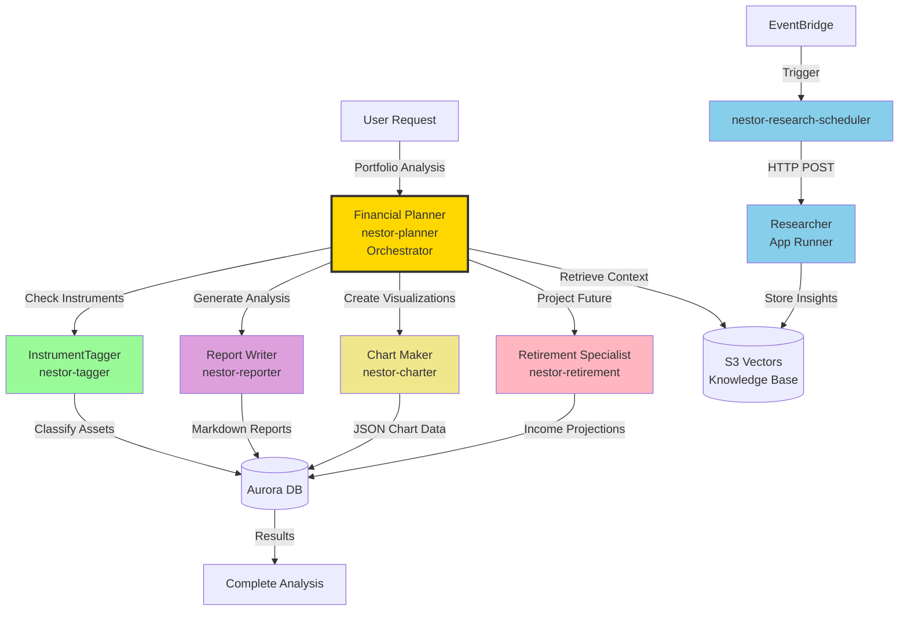
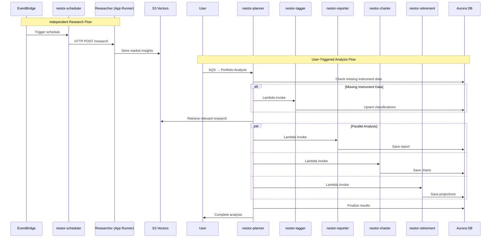
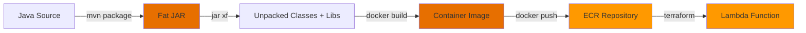

# NESTOR Agent Architecture

This document illustrates how the NESTOR AI agents collaborate. The agent roles and collaboration patterns are identical to Alex — the difference is the implementation technology (Java 21 + Spring Cloud Function instead of Python + OpenAI Agents SDK).

## Agent Collaboration Overview



## Agent Implementation Details

### Java Implementation Pattern

Each NESTOR agent follows this pattern:

```java
@Configuration
public class TaggerConfig {
    @Bean
    public Function<Map<String, Object>, Map<String, Object>> taggerFunction(
            InstrumentClassifier classifier,
            InstrumentRepository repo) {
        return new TaggerFunction(classifier, repo);
    }
}
```

The `Function<Map, Map>` bean is discovered by Spring Cloud Function and exposed as the Lambda handler via `FunctionInvoker`.

### Agent Responsibilities

| Agent | Java Module | Spring Bean | AI Pattern | Status |
|-------|-----------|-------------|------------|--------|
| **Tagger** | `nestor-tagger` | `taggerFunction` | Bedrock Converse + toolSpec (structured output) | ✅ Deployed |
| **Planner** | `nestor-planner` | `plannerFunction` | Orchestration + Lambda invocation | ✅ Deployed |
| **Reporter** | `nestor-reporter` | `reporterFunction` | Bedrock Converse + tool calling | ✅ Deployed |
| **Charter** | `nestor-charter` | `charterFunction` | Bedrock Converse (JSON extraction) | ✅ Deployed |
| **Retirement** | `nestor-retirement` | `retirementFunction` | Monte Carlo simulation + Bedrock | ✅ Deployed |
| **Scheduler** | `nestor-scheduler` | `schedulerFunction` | HTTP POST (no AI) | ✅ Deployed |

### Key Technical Differences from Alex

| Concept | Alex (Python) | NESTOR (Java) |
|---------|--------------|---------------|
| Structured outputs | Pydantic models + `output_type` | Jackson POJOs + Bedrock `toolSpec` trick (force tool call = guaranteed JSON schema) |
| Tool calling | `@function_tool` decorator | Bedrock Converse API tool definitions |
| Agent context | `RunContextWrapper[T]` | Spring dependency injection |
| Async | `asyncio` / `await` | Synchronous (or `CompletableFuture` for fan-out) |
| Retry | `tenacity` | `Resilience4j` |
| Orchestration | `Runner.run()` with `Agent` | Direct Lambda `invoke()` via AWS SDK |

## Agent Communication Flow



## Build & Deploy Workflow

Each agent follows this workflow:



Key commands:
```bash
mvn clean package -pl backend/<agent> -am -DskipTests
cd NESTOR/backend/<agent>
docker build --platform linux/amd64 --provenance=false -t nestor-<agent> .
docker tag nestor-<agent>:latest {account}.dkr.ecr.{region}.amazonaws.com/nestor-<agent>:latest
docker push {account}.dkr.ecr.{region}.amazonaws.com/nestor-<agent>:latest
aws lambda update-function-code --function-name nestor-<agent> --image-uri ...
```
