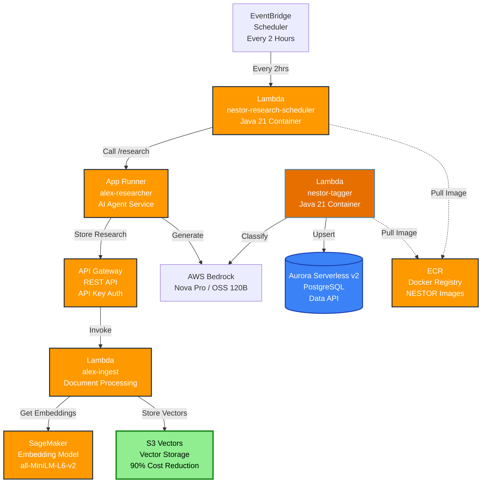
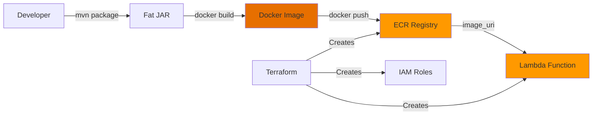

# NESTOR Architecture Overview

## System Architecture

NESTOR uses the same serverless architecture as Alex, with one key difference: all Lambda functions are deployed as **Docker container images** (Java 21 + Spring Cloud Function) instead of Python ZIP packages.

## Component Details

### NESTOR-Specific Components (Java)

| Component | Type | Image | Status |
|-----------|------|-------|--------|
| `nestor-tagger` | Lambda (Container) | `nestor-tagger:latest` | 
| `nestor-research-scheduler` | Lambda (Container) | `nestor-scheduler:latest` |
| `nestor-planner` | Lambda (Container) | `nestor-planner:latest` | 
| `nestor-reporter` | Lambda (Container) | `nestor-reporter:latest` | 
| `nestor-charter` | Lambda (Container) | `nestor-charter:latest` | 
| `nestor-retirement` | Lambda (Container) | `nestor-retirement:latest` |
| `nestor-ingest` | Lambda (Container) | `nestor-ingest:latest` |
| `nestor-api` | Lambda (Container) | `nestor-api:latest` |

### Shared Components (from Alex)

| Component | Type | Notes |
|-----------|------|-------|
| SageMaker endpoint | `alex-embedding-endpoint` | Embedding generation |
| S3 Vectors | `alex-vectors-{account-id}` | Vector storage |
| Aurora Serverless v2 | `alex-aurora-cluster` | Database |
| App Runner | `alex-researcher` | Research agent |
| API Gateway (ingest) | REST API | Ingest pipeline |
| CloudFront + S3 | Static site | Frontend |

## Technology Stack

| Layer | Alex | NESTOR |
|-------|------|--------|
| Language | Python 3.12 | Java 21 (Corretto) |
| Framework | OpenAI Agents SDK + LiteLLM | Spring Cloud Function + AWS SDK v2 |
| Build | uv + package_docker.py | Maven + Dockerfile |
| Package | ZIP → S3 → Lambda | Docker image → ECR → Lambda |
| AI Client | LiteLLM (Bedrock) | AWS SDK v2 BedrockRuntime |
| DB Client | Aurora Data API (boto3) | Aurora Data API (rds-data SDK) |
| Retry | tenacity | Resilience4j |
| JSON | Pydantic | Jackson |

## Deployment Model

## Costs

| Component | Monthly Cost |
|-----------|-------------|
| S3 Vectors | ~$30 |
| SageMaker Serverless | ~$5-10 |
| Lambda (all agents) | ~$2-5 |
| App Runner | ~$5 |
| Aurora Serverless v2 | ~$43 (1.44/day) |
| API Gateway | ~$1 |
| ECR Storage | ~$1 |
| **Total** | **~$87-95** |

ECR adds minimal cost (~$0.10/GB/month for image storage).
